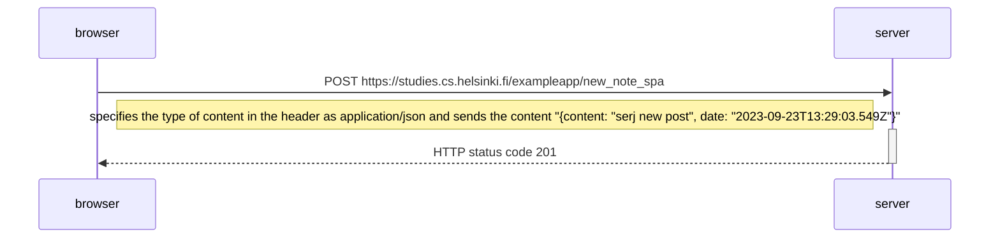

```mermaid
sequenceDiagram
participant browser
participant server

    browser->>server: POST https://studies.cs.helsinki.fi/exampleapp/new_note_spa
    Note right of browser: specifies the type of content in the header as application/json and sends the content  "{content: "serj new post", date: "2023-09-23T13:29:03.549Z"}"
    activate server
    server-->>browser: HTTP status code 201
    deactivate server


```
